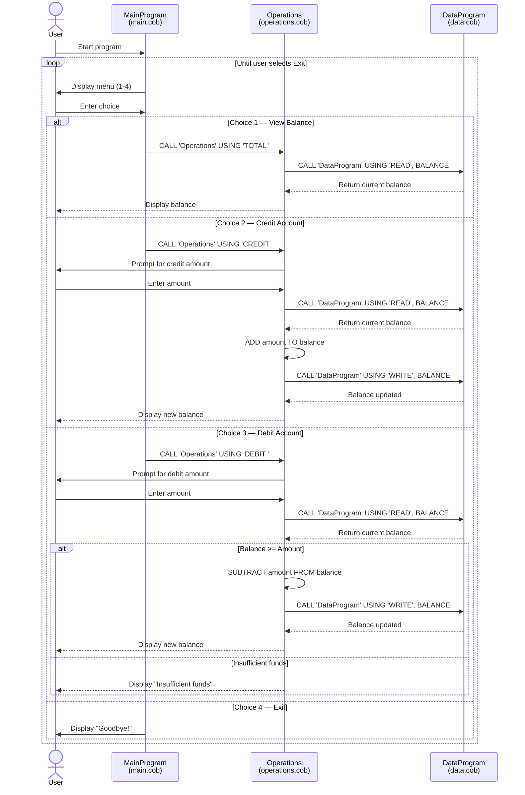

# Student Account Management System — COBOL Documentation

## Overview

This COBOL application implements a **Student Account Management System** that allows users to view balances, credit funds, and debit funds from a student account. The system follows a modular architecture split across three source files located in `src/cobol/`.

## File Descriptions

### `main.cob` — Main Program (Entry Point)

**Program ID:** `MainProgram`

Provides an interactive menu-driven interface for the account management system. It runs in a loop until the user chooses to exit.

**Key Functionality:**

| Menu Option | Action | Calls |
|---|---|---|
| 1 — View Balance | Displays the current account balance | `Operations` with `'TOTAL '` |
| 2 — Credit Account | Adds funds to the account | `Operations` with `'CREDIT'` |
| 3 — Debit Account | Withdraws funds from the account | `Operations` with `'DEBIT '` |
| 4 — Exit | Terminates the program | — |

Invalid menu selections (outside 1–4) display an error message and re-prompt.

---

### `operations.cob` — Business Logic

**Program ID:** `Operations`

Contains all business logic for account operations. It is called by `MainProgram` and delegates data persistence to `DataProgram`.

**Key Functions:**

- **TOTAL** — Reads the current balance from `DataProgram` and displays it.
- **CREDIT** — Prompts the user for an amount, reads the current balance, adds the amount, writes the updated balance back, and displays the new balance.
- **DEBIT** — Prompts the user for an amount, reads the current balance, validates sufficient funds, subtracts the amount if allowed, writes the updated balance back, and displays the new balance. If funds are insufficient, the transaction is rejected.

**Business Rules:**

1. **Insufficient Funds Protection** — A debit transaction is only processed if the current balance is greater than or equal to the requested amount. If not, the message `"Insufficient funds for this debit."` is displayed and no changes are made.
2. **Balance Precision** — Amounts use the format `PIC 9(6)V99`, supporting values up to 999,999.99 with two decimal places.
3. **Default Balance** — The working-storage balance is initialized to `1000.00`.

---

### `data.cob` — Data Storage Layer

**Program ID:** `DataProgram`

Acts as the data access layer, managing the in-memory storage of the account balance. It supports two operations passed via the linkage section:

| Operation | Behavior |
|---|---|
| `READ` | Returns the current stored balance to the caller |
| `WRITE` | Updates the stored balance with the value provided by the caller |

**Key Details:**

- The stored balance (`STORAGE-BALANCE`) is initialized to `1000.00`.
- Balance is persisted only in working storage (in-memory); it resets when the program terminates.

---

## Call Flow

```
MainProgram (main.cob)
  └── Operations (operations.cob)
        └── DataProgram (data.cob)
```

1. `MainProgram` accepts user input and calls `Operations` with the requested operation type.
2. `Operations` implements the business logic and calls `DataProgram` to read or write the balance.
3. `DataProgram` manages the in-memory balance store.

## Business Rules Summary

| Rule | Description |
|---|---|
| Initial Balance | Every student account starts with a balance of **1,000.00** |
| Debit Guard | Debits are rejected if the requested amount exceeds the current balance |
| Balance Range | Balances support values from **0.00** to **999,999.99** |
| Persistence | Balance is stored in memory only; no file or database persistence |

## Sequence Diagram


